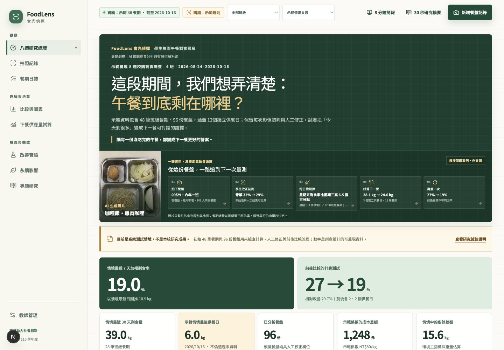
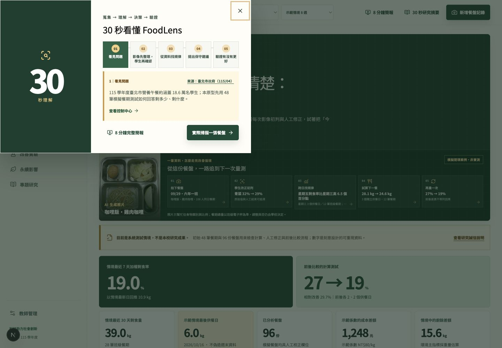
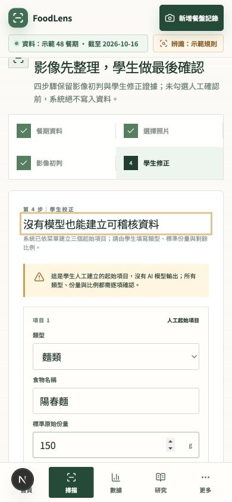
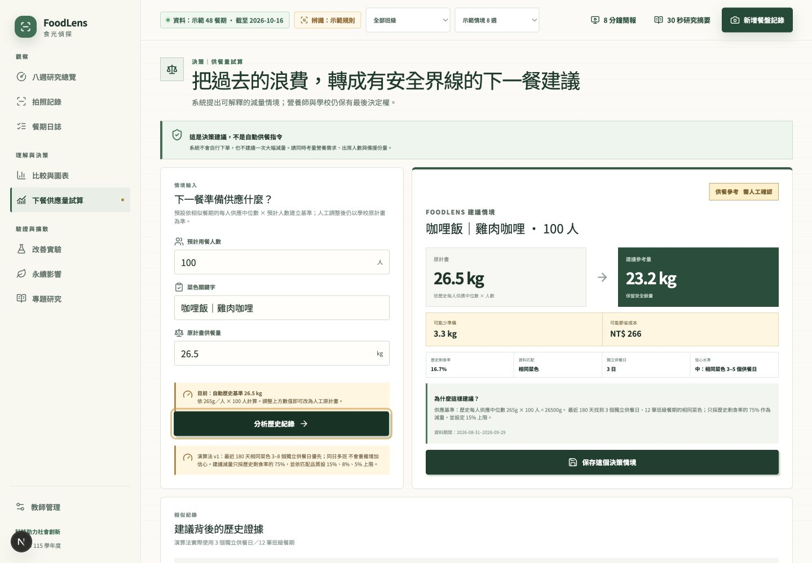
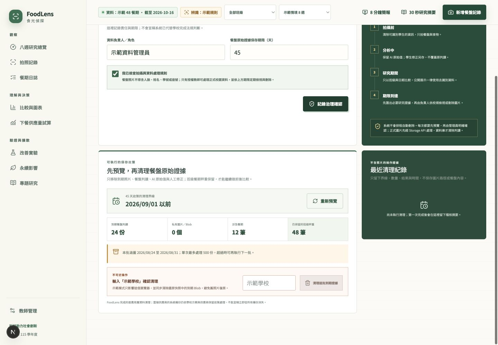
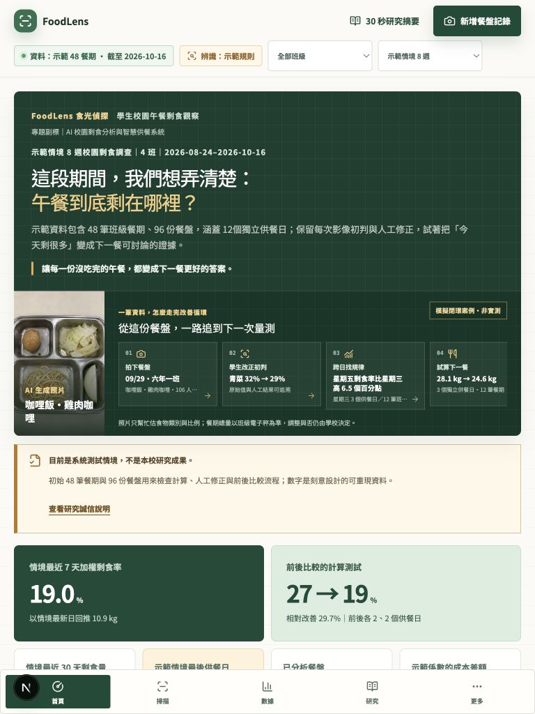
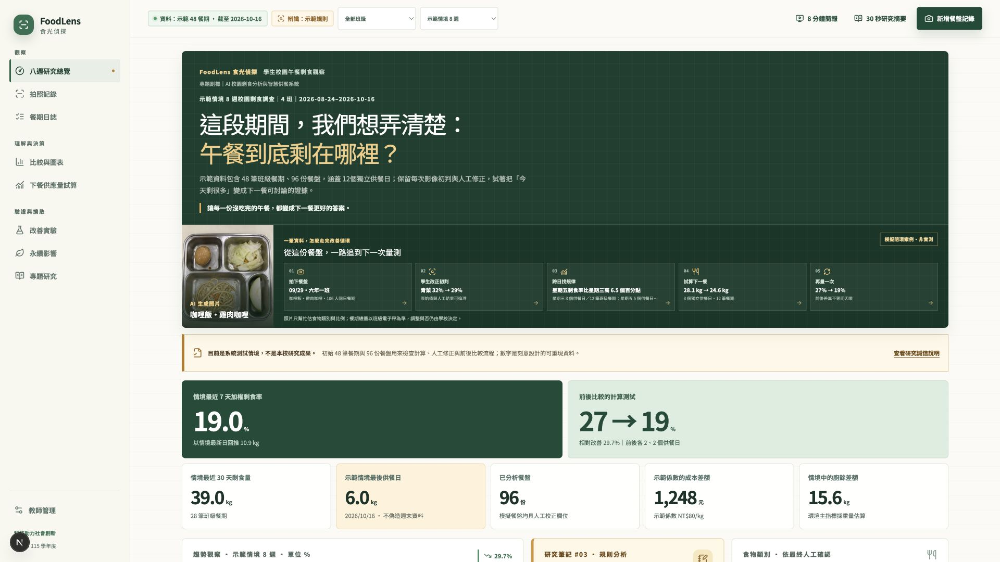

# FoodLens 產品化稽核 Round 4

稽核日期：2026-09-01（Asia/Taipei）

## 結論

FoodLens 已形成可離線展示、可持久化操作、可追溯人機協作的完整產品閉環：餐盤蒐集、影像初判或純人工判讀、學生確認、餐期證據、規則洞察、保守供餐建議、決策快照、改善實驗與永續估算都使用同一份資料模型。無環境變數時可完成 Demo；正式雲端與真實模型仍需校方 Supabase／AI 憑證才能做遠端驗收。

## 1. 評審 30 秒理解

- 控制中心首屏同時呈現問題、資料範圍、模擬標籤、七項 KPI 與單筆閉環案例。
- 30 秒導覽以單頁五節點呈現全貌；8 分鐘模式提供八段固定敘事、鍵盤換頁與投影版字級。
- 全站永久區分「示範／實測資料」與「Mock／真實／人工判讀」，生成圖片亦標示不納入研究樣本。

## 2. 學生操作與人機協作

- 掃描採餐期、照片、判讀、人工確認四步；沒有模型時可直接建立人工判讀表，不必假裝由 AI 產生。
- AI 原始值與學生修改分開保存；若學生只確認未改值，紀錄誠實顯示 0 項調整。
- 草稿保存表單、處理後照片與判讀進度；恢復後仍須重新確認餐期歸屬與結果。
- 同班同日午餐不再靠菜名靜默猜測，使用者必須明確選擇附加既有餐期或建立獨立紀錄。

## 3. 決策與驗證閉環

- 預計人數可依相似餐期每人供應量中位數建立原計畫基準；教師亦可保留人工輸入的原計畫量。
- 建議同時顯示相似紀錄、歷史剩食率、減量上限、節省重量、成本、信心與「由人決定」聲明。
- 保存時記錄原計畫、建議量、採用／調整／維持方式與實際採用量，再連結至改善實驗。
- 實驗使用自身固定日期與班級範圍，不會被 Dashboard 的暫時篩選改寫；同時呈現百分點、相對改善、樣本數與因果限制。

## 4. 正式資料治理

- 本機 Demo 清理會以單一 IndexedDB transaction 同步處理目前狀態與 recovery，保留去識別班級秤重與稽核摘要。
- 校園雲端只允許唯一校園 membership 的 admin 執行保存期限清理；瀏覽器無法直接刪餐期或任意同校圖片。
- 雲端採兩階段流程：先固定最多 500 份目標，再由伺服器端 Storage API 刪除 private 圖片，最後確認物件已不存在才清除餐盤判讀。
- 原始模型偵測不可更新；近期新增掃描或修正會保護舊餐期不被過早清理。介面明確說明「應用層完成」不等同供應商備份立即永久消失。

## 5. 響應式與可及性

- 實測尺寸：390×844、768×1024、1440×900／1000、1920×1080。
- 10 個路由均接受 axe WCAG A/AA 掃描並檢查水平溢位。
- 觸控目標至少 44px；焦點可見；原生對話框可由 Esc 關閉並回到啟動按鈕；支援 reduced-motion。
- 圖表有標題、單位、期間、樣本數與可展開資料表替代內容。

## 6. 驗收證據

最後一輪均為無 retry 的乾淨通過：

| Gate                                 | 結果                                                  |
| ------------------------------------ | ----------------------------------------------------- |
| Prettier                             | 通過                                                  |
| ESLint                               | 通過                                                  |
| Next route types + TypeScript strict | 通過                                                  |
| Vitest                               | 21 files、123 tests 通過                              |
| Next.js 16.3.3 production build      | 16/16 static pages 完成                               |
| Playwright                           | 93 passed、51 intentional skips、0 failed；矩陣共 144 |
| Supabase pgTAP                       | 2 files、96 tests 通過                                |
| Supabase database advisors           | 0 issues                                              |
| npm production audit                 | 0 vulnerabilities                                     |
| `git diff --check`                   | 通過                                                  |
| Vercel remote build                  | Ready／Preview；16/16 static pages 完成               |

## 尚未宣稱完成的遠端邊界

- 未取得正式 Supabase 專案、教師 Auth 使用者與校方資料，因此未做遠端跨校登入、private Storage 與 Email Magic Link 實測。
- 未取得真實模型 API Key，因此只驗證 deterministic Mock、純人工判讀與真實 adapter 的 schema／權限／失敗路徑。
- Vercel build 已完成，僅保留 `target: null` 的 Preview：<https://foodlens-school-doqvsowid-timdirtys-projects.vercel.app>。CLI 將新專案第一次部署自動指向 Production 後，該 deployment 與 alias 已立即移除；目前 deployment 清單只剩 Ready／Preview。對外分享前仍應確認競賽「作品未經刊登」規範，並在帳號方案支援時啟用 Deployment Protection。
