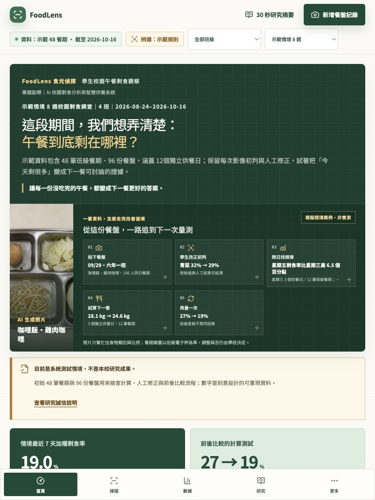
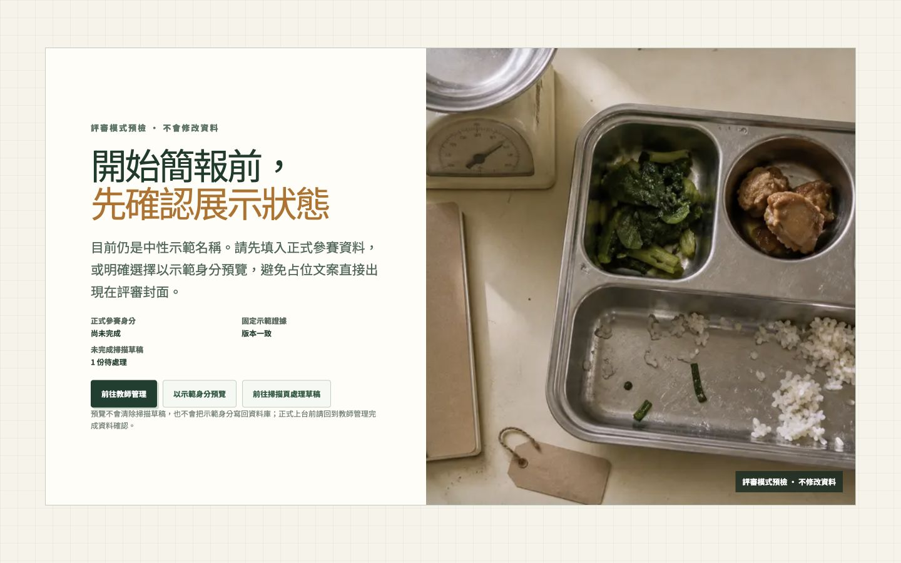
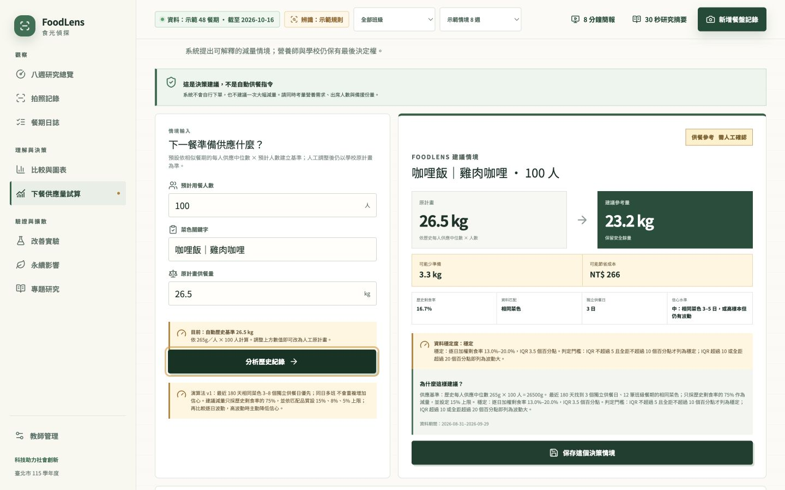

# FoodLens 產品化稽核 Round 5

稽核日期：2026-09-04（Asia/Taipei）

## 結論

這一輪把 FoodLens 從「功能完整的競賽原型」推進成更可預測的現場產品：平板首屏不再裁掉改善循環最後一步；簡報開始前會先檢查正式身分、固定 Demo 證據與未完成草稿；掃描完成後有連續的證據－洞察－試算路徑；供餐建議會因逐日資料波動而降低信心；production build 可以封裝成可驗雜湊、可從另一個資料夾與備用連接埠啟動的離線包。

## 1. 評審 30 秒動線：健康

1. 首頁第一屏先說明問題、資料範圍、模擬身分與人機分工。
2. 單筆餐盤可追到學生修正、跨日規律、供餐試算與再次量測。
3. 768px 原本第 5 步位於 viewport 外；現在改為 3＋2 的可見網格，五步 bounding box 都落在 0–768px 內。
4. 手機改為兩欄並讓最後一步跨欄，不再依賴沒有提示的橫向滑動。

## 2. 評審簡報進場：健康

- 正式學校、團隊與成員未填時，不會直接把占位文字帶上封面。
- 預檢同時顯示固定示範證據是否一致、未完成掃描草稿數量與對應處理入口。
- 使用者仍可明確選擇「以示範身分預覽」；這個選擇不會修改、重設或刪除任何資料。
- `demoReady` 採 fail-closed：身分、固定證據、草稿讀取任一未確認，管理狀態都不能宣稱 Live Demo 已就緒。

## 3. 學生完成掃描後的接力：健康

- 完成頁新增三段連續路徑：核對原始判斷與學生修正 → 看資料如何改變 → 試算下一餐。
- 第一段使用該餐期 ID 深連結至證據；原有「查看每日紀錄」仍保留，既有操作測試不受破壞。
- 保存供餐建議後，原位主按鈕直接轉成「已保存・下一步建立改善實驗」，不用先滑過歷史清單再找入口。

## 4. 供餐建議可信度：健康

- 同日多班先以供應重量彙整成一個獨立供餐日，再比較日期間的剩食率。
- 顯示最低值、Q1、Q3、最高值、IQR 與全距；樣本數不再是唯一信心依據。
- 六個相同菜色日若結果極端分散，會由高信心降為低；六個低波動日期才可維持高信心。
- 建議仍清楚標示為供餐參考，總重量來自電子秤餐期資料；照片只協助整理食物類別與剩餘比例。

## 5. 離線現場韌性：健康

- Next.js 使用 standalone output；製包腳本加入 `.next/static`、`public`、啟動器、健康檢查、版本資訊與 SHA-256 清單。
- 最終包為 61 MB、1,498 個雜湊項目，記錄 Next.js 16.3.3、Node.js 22、`darwin/arm64` 與 Build ID。
- 啟動器會先阻擋錯誤 Node major、作業系統或 CPU 架構，避免用 cryptic native module 錯誤臨場失敗。
- 最終 smoke test 把整包複製到系統暫存目錄，在隨機埠 `64997` 啟動，`GET /` 回傳 200 且內容確認為 FoodLens。

## 6. 最終驗收證據

最終結果均為零 retry 的乾淨通過：

| Gate                                 | 結果                                                  |
| ------------------------------------ | ----------------------------------------------------- |
| `npm install --no-audit --no-fund`   | up to date                                            |
| Prettier                             | 全專案通過                                            |
| ESLint                               | 全專案通過                                            |
| Next route types + TypeScript strict | 通過                                                  |
| Vitest                               | 21 files、127 tests 通過                              |
| Next.js production build             | 16/16 static pages 完成                               |
| Playwright                           | 94 passed、54 intentional skips、0 failed；矩陣共 148 |
| 響應式幾何回歸                       | 768px 五個閉環步驟全部位於 viewport 內                |
| 離線工具 Node tests                  | 2/2 通過                                              |
| 離線完整性／可攜啟動                 | 1,498 項 SHA-256、暫存目錄、隨機埠、HTTP 200 通過     |
| npm production audit                 | 0 vulnerabilities                                     |
| `git diff --check`                   | 通過                                                  |

Supabase migration、RLS 與 Storage 在 Round 4 已通過 96 項 pgTAP；本輪沒有修改資料庫檔案，因此沒有重跑本機 Supabase stack。

## 尚未宣稱完成的邊界

- 目前 repository 尚無 Git HEAD，所有來源檔仍是 untracked；雖然產品與測試可執行，但還沒有可回滾的 release baseline。未經使用者明確要求，本輪沒有自行 commit。
- 未提供正式 Supabase、教師帳號與真實模型金鑰，因此遠端校園模式仍只具備完成的實作與本機測試證據。
- 最新 Vercel Preview 更新時，既有 CLI 憑證回傳 `Not authorized`，claimable fallback 端點亦未完成傳輸；因此本輪不把舊 Preview 冒充成最新版本。重新登入 Vercel 後才應更新受保護的 Preview。
- 目前瀏覽器確實有一份未完成掃描草稿且正式參賽身分未填；新預檢會如實攔住，而不是清除資料或顯示錯誤的「已就緒」。
