# FoodLens 瀏覽器產品稽核 Round 7

稽核時間：2026-09-05 19:31 CST（Asia/Taipei）  
稽核方式：使用使用者目前選定的 Codex 內建瀏覽器，操作本機 `http://localhost:3000`；未改用另一個瀏覽器或 CLI 自動化規避產品邊界。

## 結論

本輪已用真實可互動頁面走過「看懂問題 → 完成一餐 → 影像初判與人工修正 → 查閱證據 → 跨日分析 → 供餐試算 → 改善實驗 → 去向核驗 → 評審簡報」主線。390px 手機、768px 平板、1440px 桌機與 1920×1080 投影狀態均未觀察到水平溢位；關鍵限制、示範／實測資料、Mock／真實 AI 與秤重／影像估計的差異均保留在介面上。

這是本輪的**視覺、互動與幾何證據**，不是正式校園實測、真人螢幕閱讀器、實體相機、受管理 iPad 或遠端 Supabase 的替代證明。

## 1. 評審 30 秒入口：健康

控制中心首屏同時回答問題規模、資料身分、人機分工、改善證據與下一步，沒有退化成只有口號的品牌頁。桌機、手機與平板皆能看見主要 KPI 與任務入口。

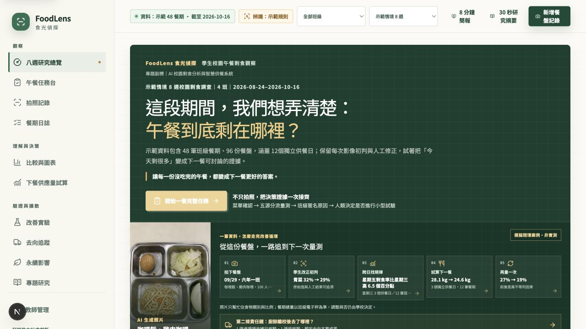

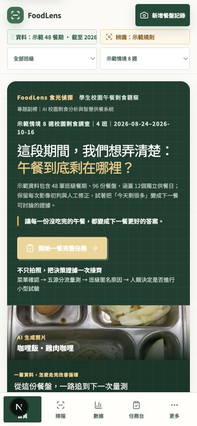

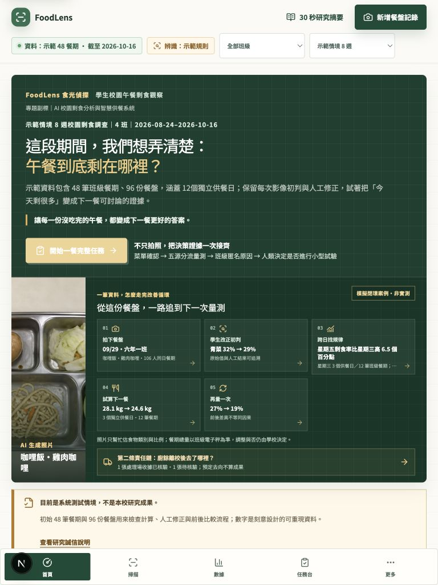

## 2. 一餐證據鏈：健康

午餐任務台把智慧菜單、學生確認、五源秤重、匿名原因與人類決策排成四個可理解階段；菜單候選是待確認內容，不被描述成精確辨識或自動決策。

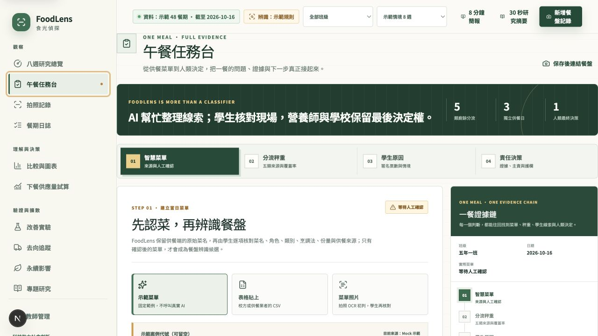

本輪再補上案件工作區：可先選班級與日期建立新餐期，也能切換同模式的已保存案例與未完成草稿；網址以 `?case=` 固定案件。草稿停頓 600ms 後寫入 IndexedDB，重新整理可恢復；快速切換或建立案件前，系統會取消尚未觸發的倒數、寫入最新草稿並等待案件索引更新。保存失敗時會留在原案件顯示可操作的錯誤，不會悄悄離開。正式量測確認與最後人類決策一律不會被代簽；只有尚未成功落盤的變更才會觸發離頁警告。Demo Reset 會一併清除 Demo 掃描與任務台草稿，不影響校園雲端資料。

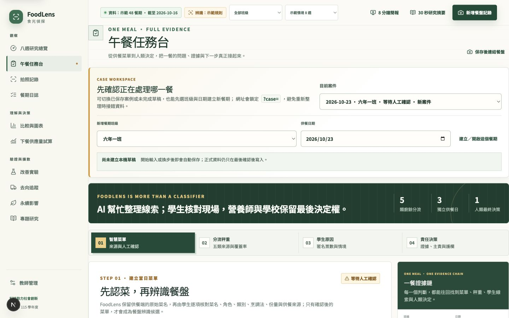

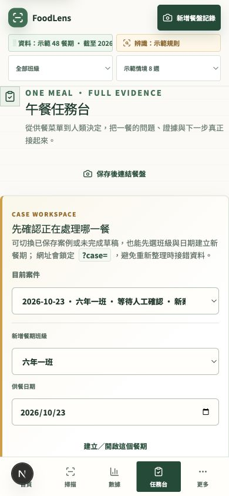

## 3. 掃描與人機協作：健康

- 先選餐期，再選照片、進行初判、人工修正，最後確認保存。
- 「從相簿或檔案選擇」與「使用手機相機拍照」是兩個獨立入口，避免行動裝置只能被迫開啟相機。
- CTA 附近會說明尚缺餐期或照片；來源按鈕在 390px 改為單欄且維持至少 44px 的觸控高度。
- 結果頁保留 AI 原值與學生最終值；單張照片只估計類別與剩餘比例，不冒充班級電子秤總量。
- 瀏覽器安全重編碼後，伺服器仍會驗證 WebP RIFF 長度、chunk allowlist、實際尺寸與 4,000,000 bytes 上限，並拒絕 EXIF／XMP／ICC、假 MIME、容器長度不符與超過 1600px 圖片。雲端 `plate-images` 另限 WebP、4MB，只允許同校 teacher／admin 讀取。

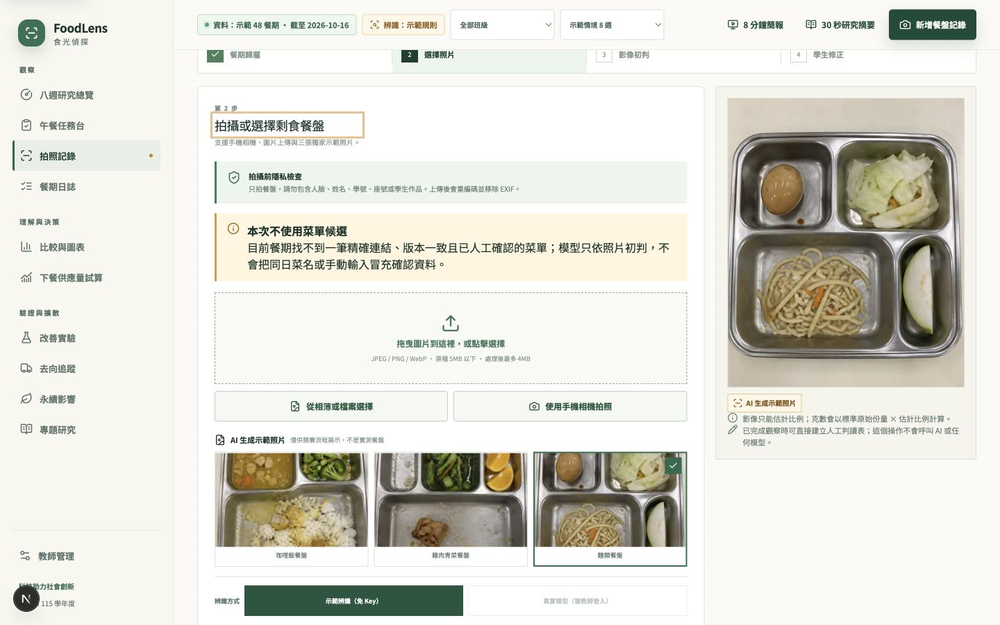

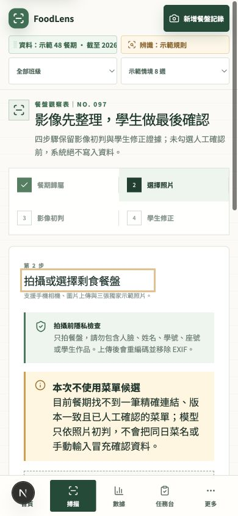

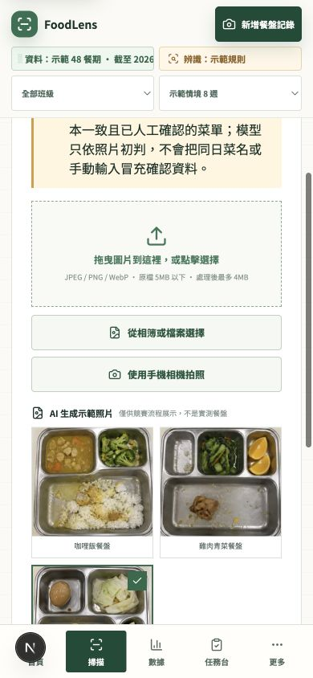

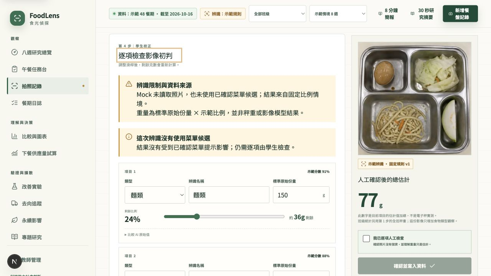

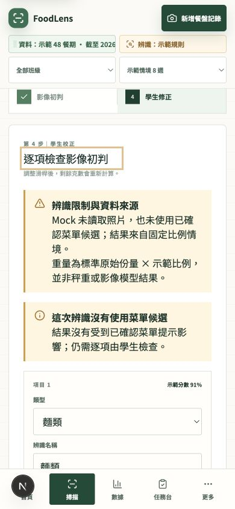

## 4. 紀錄與來源脈絡：健康，保守顯示舊資料

`/records?meal=...` 能從完整資料快照解析指定餐期；即使被全站日期或班級篩選排除，仍會暫時顯示並解釋原因，不會靜默變成空頁。當操作者開始本頁搜尋或篩選，系統會移除網址的 `meal` 固定狀態、保留其他 query 與 hash，以新搜尋意圖呈現誠實筆數；瀏覽器實操已驗證無匹配時顯示 `0 筆結果`。展開紀錄後可核對 AI 原始判斷、學生修正、修正註記與保存來源。

本截圖中的固定 seed 掃描是舊版資料，因此介面正確顯示「未保存菜單脈絡」，沒有事後回推。新確認且精確連結餐期的掃描，會持久化菜單版本、候選簽章與候選數量；一旦被掃描引用，資料庫即拒絕改寫／刪除該菜單版本，也拒絕對其候選新增、改寫或刪除；修正必須建立後續版本。另一班級仍可用不同 client UUID 安全重用內容完全相同的 canonical 菜單與候選，且不會轉移原確認人或更新證據時間。修正註記在雲端也依偵測順序完整對齊，參與原子重送指紋，每項最多 300 字。這些正向案例的完整性由 repository、RPC 與資料庫測試證明，不以舊 seed 截圖冒充。

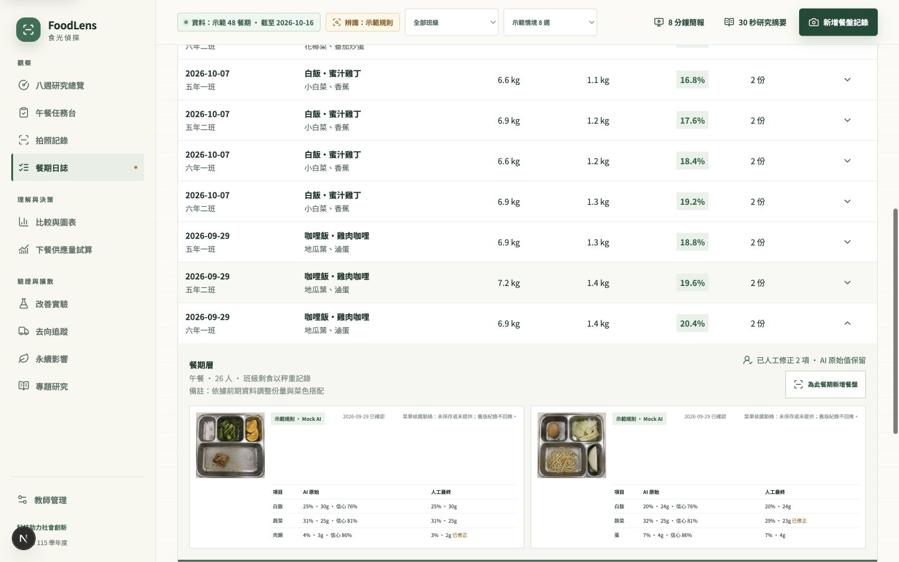

## 5. 數據實驗室：健康

數據實驗室顯示期間、樣本數、單位與加權剩食率，並提供圖表的表格替代內容。規則型洞察由目前資料計算，樣本不足時不硬產生結論。

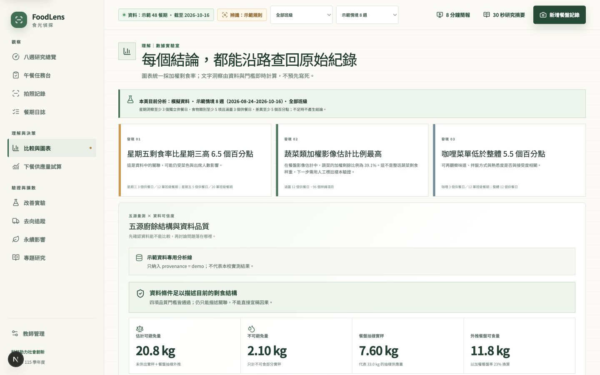

## 6. 智慧供餐試算：健康

歷史相似餐期、日間波動、建議量、安全上限、可能節省與信心水準同時呈現。歷史證據已使用有 caption 與欄頭語意的真實資料表；按鈕停用時會列出缺少的輸入。介面固定說明這是決策建議，最終仍由營養師或學校決定。

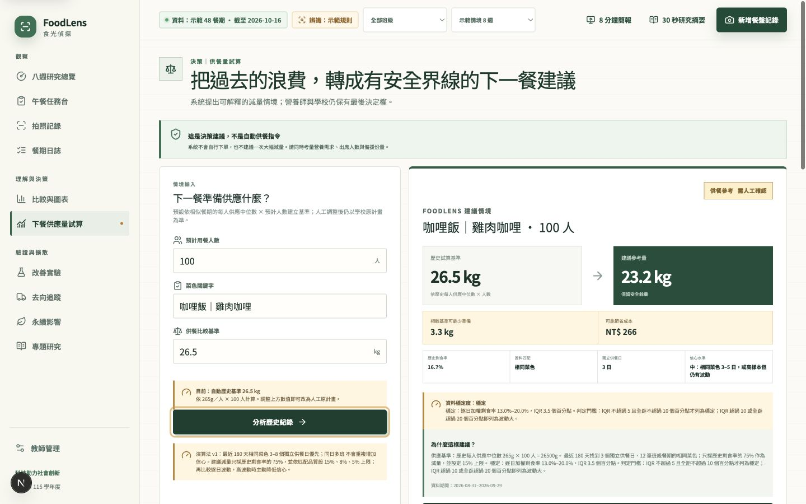

## 7. 改善實驗：健康

前後比較並列原始比例、下降百分點、相對改善率、樣本數與安全護欄；示範模式的 27% → 19% 不被描述成本校研究成果，介面也明示前後比較不等同因果。

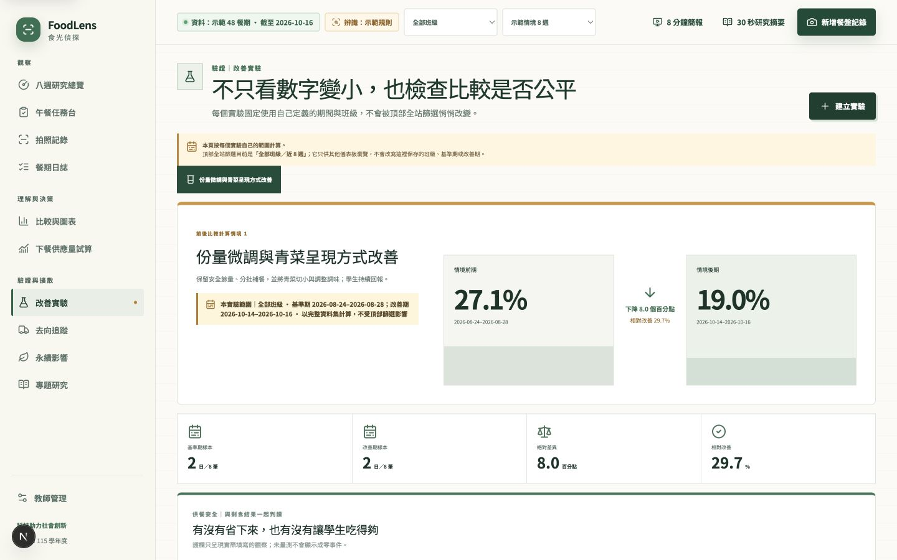

## 8. 去向核驗與永續影響：健康

去向追蹤分開預定安排、清運交接、處理端申報與校方核驗；批次切換後焦點移到目前操作區並以 live status 公告階段。只有核驗完成的收據可列為實際去向，Impact 主指標仍是可解釋的重量與成本估算，不虛構碳排。

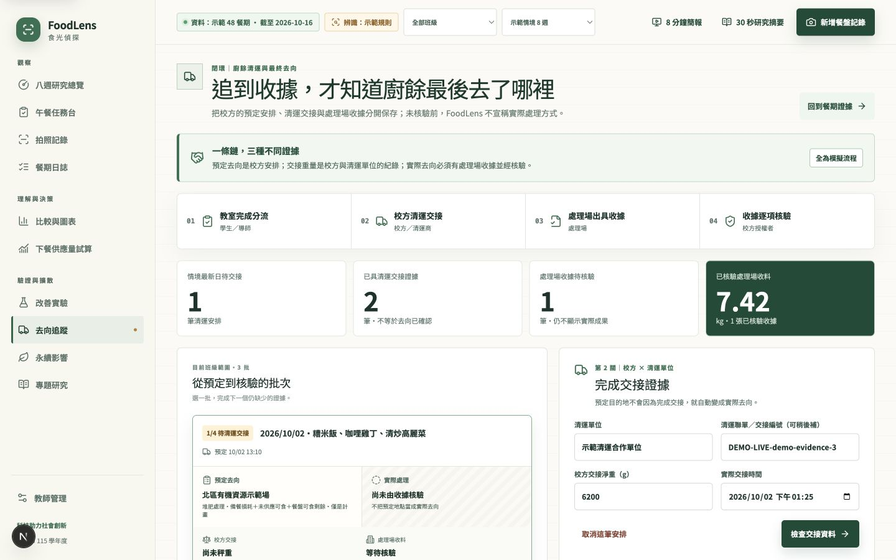

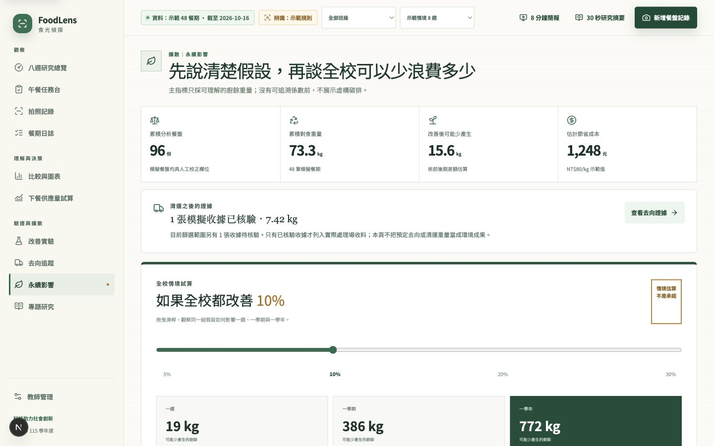

## 9. 評審簡報與教師管理：健康

1920×1080 投影預檢會先揭露示範身分、固定證據，並以唯讀方式合計未完成的掃描／午餐任務草稿。本輪實操顯示「掃描 1・午餐任務 0」及對應處理入口，預檢不會刪除草稿或把示範身分寫回資料庫。之後才由操作者明確選擇是否以示範身分預覽。8 分鐘模式填滿投影畫面，顯示計時與 1/8 進度；教師管理則集中正式啟用、係數、資料可攜與登入入口。

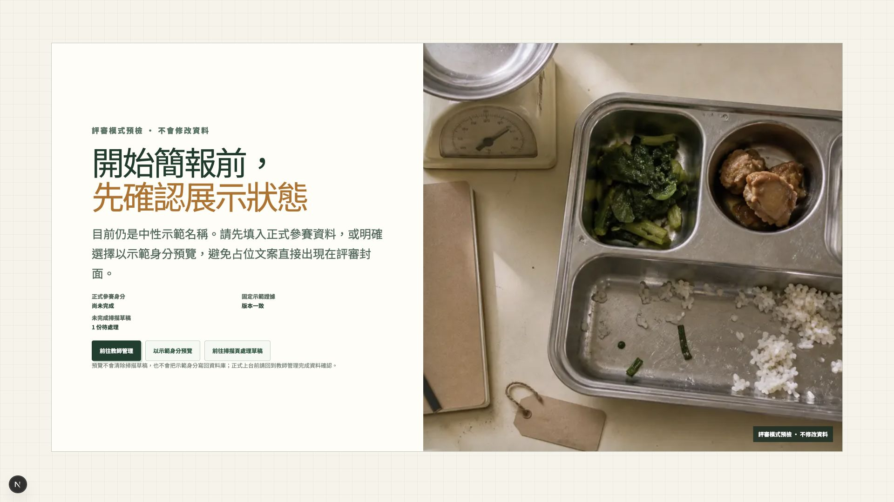

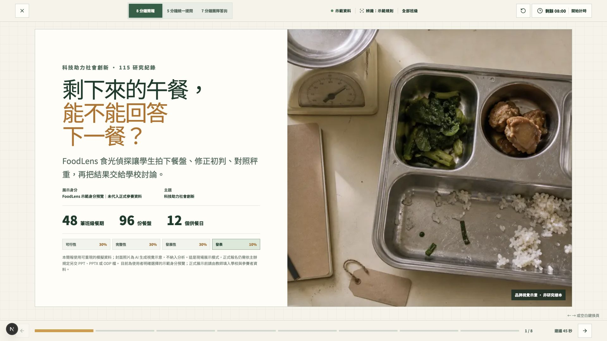

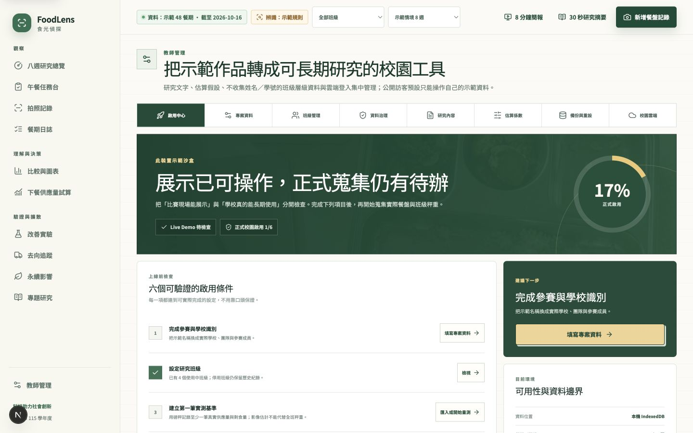

## 10. 四尺寸幾何與互動證據

| 目標    | 實際 viewport | 本輪固定 5 路由回歸                                                                    |
| ------- | ------------: | -------------------------------------------------------------------------------------- |
| 手機    |       390×844 | `/`、`/workflow?case=...`、`/records?meal=...`、`/trace`、`/presentation` 均無水平溢位 |
| iPad    |      768×1024 | 同上 5 路由；`scrollWidth === innerWidth`，標題與主要任務可見                          |
| MacBook |      1440×900 | 同上 5 路由；案件工作區、紀錄證據、去向操作與預檢均可讀                                |
| 投影    |     1920×1080 | 同上 5 路由；評審預檢、控制中心與案件頁均無 viewport 溢位                              |

四種尺寸共 20 組 route／viewport 檢查，每組均實際量測 `document.documentElement.scrollWidth === innerWidth`。表格外的 Lab、Forecast、Experiments、Impact、Admin 與掃描畫面仍保留本輪早先擷取的可讀視覺證據，但不將它們冒充為這 20 組固定回歸。

本輪另驗證：

- Trace 的送出前確認與建立清運安排兩個分支，都會在確認區出現時把焦點移入，返回編輯器後把焦點還給原觸發按鈕；切換批次仍會公告目前階段。
- Records 深連結指定餐期會自動展開，且能看見該餐期影像、判讀與修正證據；一旦使用本頁搜尋，即退出 `meal` 固定狀態並顯示真實篩選結果。
- Presentation 預檢會同時檢查掃描與午餐任務草稿；任一儲存區無法讀取或尚有草稿，都不會被設為「預檢通過」。
- 掃描手機頁的兩個照片來源不重疊、不被裁切，也不產生水平捲動。

## 11. 程式、資料庫與離線備援門檻

| Gate                                 | 本輪狀態                                                                                                     |
| ------------------------------------ | ------------------------------------------------------------------------------------------------------------ |
| `npm install`                        | lockfile 依賴可安裝；本輪 release 最終狀態為 up to date                                                      |
| Prettier                             | 完整 `npm run verify` 通過                                                                                   |
| ESLint                               | 完整 `npm run verify` 通過                                                                                   |
| Next route types + TypeScript strict | 完整 `npm run verify` 通過                                                                                   |
| Vitest                               | 44 files、359/359 passed；IndexedDB 高負載競態修正後於完整 verify 一次通過                                   |
| Next.js production build             | Next.js 16.3.3 production build 通過；Build ID `gpfeH24-NjpD6_2TQoJme`                                       |
| Supabase clean reset                 | 20 個 migrations 與 seed 從零重新套用成功                                                                    |
| Supabase pgTAP                       | 3 files、271/271 passed                                                                                      |
| Supabase schema lint／advisors       | `public`、`private`，warning level；0 issues                                                                 |
| npm audit                            | `--audit-level=high`；0 vulnerabilities                                                                      |
| 離線工具測試                         | 3/3 passed                                                                                                   |
| 離線完整性與 smoke                   | 1,558 個檔案通過 SHA-256；已複製到系統暫存目錄並以隨機 port 實際啟動                                         |
| 離線代表路由                         | `/`、`/workflow`、`/scan`、`/lab`、`/presentation` 與代表 JavaScript 資產皆回應成功                          |
| `git diff --check`                   | Repository 尚無 HEAD，未追蹤檔案無法由此指令有效比對；全專案內容改由 Prettier、lint、typecheck 與 build 檢查 |

本輪新增四道雲端證據邊界：`correction_notes` 與偵測順序對齊並納入原子重送指紋；`plate-images` 縮緊為 WebP／4MB／teacher-admin 私有讀取；被掃描引用的菜單版本與候選項目不可改寫；另一班級只可重用 material-equivalent canonical 菜單，任何內容變動仍拒絕。這些邊界已納入上述 271 項 pgTAP。

本輪最新離線包識別：

- 路徑：`dist/foodlens-offline`
- 大小：65 MB
- 檔案清單：1,558 項 SHA-256
- Build ID：`gpfeH24-NjpD6_2TQoJme`
- Next.js：`16.3.3`
- Node.js major：`22`
- 平台：`darwin/arm64`
- Source revision：`null`
- Source state：`no-head`

## 尚未宣稱完成的邊界

- 本輪瀏覽器驗收不是 VoiceOver／NVDA 或真人使用者測試。
- 沒有用實體手機相機、學校受管理 iPad 或現場投影設備完成硬體驗收。
- 沒有建立新的正式掃描來改寫使用者現有草稿；正向菜單脈絡以程式與資料庫測試為準。
- 沒有正式學校資料、遠端 Supabase membership、真實 AI 金鑰或四週研究結果。
- 沒有部署、發布、Git commit 或可回滾封版點。
